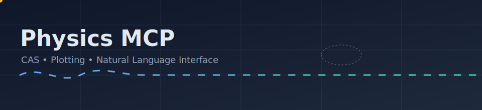

# Configuration

<p align="center">
  
</p>

[Home](../README.md) · [Architecture](Architecture.md) · [Configuration](Configuration.md) · Tools: [CAS](Tools/CAS.md) · [Plot](Tools/Plot.md) · [NLI](Tools/NLI.md)

Environment Variables (NLI)
- `LM_BASE_URL`: Base URL for the local LM API (e.g., `http://localhost:1234/v1` for LM Studio)
- `LM_API_KEY`: Optional API key if your local API requires it
- `DEFAULT_MODEL`: Model name to use (e.g., `qwen2.5-coder`)

MCP Client Config
- See `mcp_config.json` for a ready-to-use entry. Example:

```
{
  "mcpServers": {
    "phys-mcp": {
      "command": "node",
      "args": ["packages/server/dist/index.js"],
      "env": {
        "LM_BASE_URL": "http://localhost:1234/v1",
        "LM_API_KEY": "",
        "DEFAULT_MODEL": "qwen2.5-coder"
      },
      "disabled": false
    }
  }
}
```

Python Worker Dependencies
- Declared in `packages/python-worker/requirements.txt`
- Install with: `pip install -r packages/python-worker/requirements.txt`

Local Development
- Build: `pnpm build`
- Run: `pnpm dev` or `node packages/server/dist/index.js`
- Test: `pnpm run test:install`

Joke in reduced units: the NLI won’t violate causality—no model calls without `LM_BASE_URL`.
