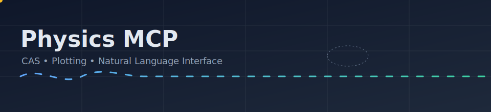

# NLI Tool

<p align="center">
  
</p>

[Home](../../README.md) · [Architecture](../Architecture.md) · [Configuration](../Configuration.md) · Tools: [CAS](CAS.md) · [Plot](Plot.md) · [NLI](NLI.md)

Natural Language Interface parses free-text physics requests into structured tool calls.

Tool
- 
li_parse`
  - Params: `text` (string)
  - Returns: `{ intent, args, confidence?, explanation? }`
  - Example request:
    ```json
    {"jsonrpc":"2.0","id":"1","method":"nli_parse","params":{
      "text":"Plot y = x^2 from -5 to 5"
    }}
    ```

Intents
- CAS: `cas_evaluate`, `cas_diff`, `cas_integrate`, `cas_solve_equation`, `cas_solve_ode`
- Plot: `plot_function_2d`, `plot_parametric_2d`, `plot_field_2d`
- Unknown: `unknown` with an explanation when parsing fails

Operation
- Primary: calls a local LM API (`/chat/completions`) with a physics-aware system prompt when configured.
- Fallback: rule-based parser using regex patterns for common tasks when no LM is configured.

Configuration
- Optional: LM Studio (or any OpenAI-compatible local endpoint). Not required for core calculations.
- Environment (optional): `LM_BASE_URL`, `DEFAULT_MODEL`, and `LM_API_KEY` if your local server requires it.

Why a local LM helps (optional)
- Lower latency and fewer retries on complex requests → faster end-to-end results.
- Uses your GPU (when available) to accelerate parsing.
- Privacy and cost benefits from keeping tokens local.

Quick setup (LM Studio)
1. Install and run LM Studio.
2. Set `LM_BASE_URL` to the OpenAI-compatible endpoint (e.g., `http://localhost:1234/v1`).
3. Set `DEFAULT_MODEL` to your chosen local model.

Schemas & Prompt
- Types and prompt: `packages/tools-nli/src/schema.ts`
- Logic and LM usage: `packages/tools-nli/src/index.ts`

A gentle quip: we keep the parsing Hamiltonian simple-no unnecessary terms, just enough to reach the ground truth.


