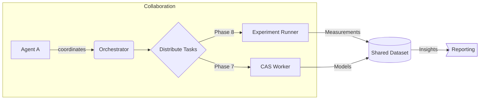

# Mermaid & KaTeX Demo

This page verifies that diagramming and math rendering work end-to-end. Use it as a smoke test after enabling Mermaid and KaTeX in your docs stack.

## Mermaid Flow



If your static generator cannot inline Mermaid automatically, pre-render to SVG during build time to keep page loads fast.

## KaTeX Block Math

```latex
$$
\Phi(t) = \int_{0}^{t} \Big(\mathbf{E}(\tau) \cdot \mathbf{J}(\tau)\Big)\,d\tau,
\qquad \frac{d}{dt}\left(\nabla \times \mathbf{B}\right) = \mu_0 \mathbf{J} + \mu_0\varepsilon_0 \frac{\partial \mathbf{E}}{\partial t}
$$
```

## Inline Math

When referencing inline expressions, wrap them in single dollar signs like `$E=mc^2$`. For named quantities, prefer `\mathrm{}` for roman type: `$\mathrm{Re}(z)$`.

## Testing Checklist

1. Page renders without blocking scripts.
2. Mermaid diagram gets hydrated/converted to SVG.
3. KaTeX outputs accessible markup (`role="img"` + hidden MathML fallback).
4. Reduced-motion still applies to any animated headers.
